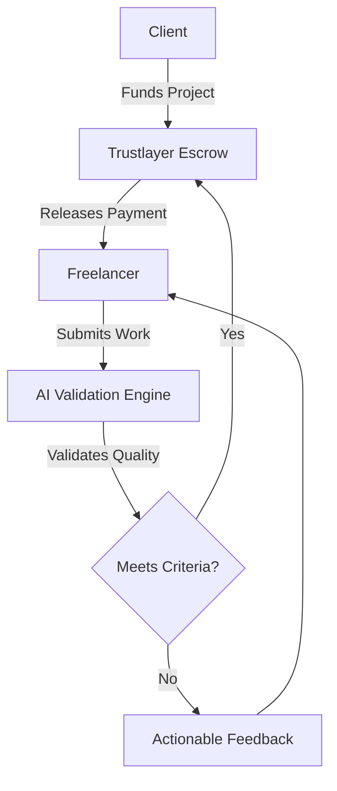

<div align="center">
  
  <h1>Trustlayer</h1>
  <p><strong>AI-powered freelance trust & validation system that automatically validates work quality and releases payment securely | Hacknovate 7.0</strong></p>
</div>

---

## 🚀 Overview

Trustlayer bridges the trust gap between freelancers and clients. Built for **Hacknovate 7.0**, this platform acts as an intelligent escrow and validation layer. It leverages AI to automatically verify the quality of work submitted by freelancers. Once the work meets the predefined criteria, Trustlayer securely releases the payment—ensuring fairness, transparency, and zero friction.

## ✨ Key Features

- **🤖 AI-Powered Validation:** Automated assessment of submitted work against project requirements to ensure high quality.
- **🔒 Secure Payments:** Funds are held in a secure escrow-like environment and are only released upon successful AI validation.
- **⚡ Frictionless Experience:** Eliminates the need for prolonged back-and-forth negotiations and manual reviews.
- **📊 Transparent Workflow:** Both clients and freelancers have real-time visibility into the project's validation status.

## 🏗️ Architecture



## 📁 Project Structure

```text
Trustlayer/
├── frontend/       # Web application (UI/UX)
├── backend/        # API, Escrow Logic, and Integrations
├── docs/           # Architecture diagrams and API documentation
└── assets/         # Static assets and images for documentation
```

## 🛠️ Tech Stack (To be updated)
- **Frontend**: *[Insert Tech Stack]*
- **Backend**: *[Insert Tech Stack]*
- **AI/ML**: *[Insert Validation Models]*
- **Payments**: *[Insert Payment Gateway / Blockchain]*

## 🏁 Getting Started

### Prerequisites
- Node.js (v18+)
- Python (3.10+)
- Git

### Installation

1. **Clone the repository**
   ```bash
   git clone https://github.com/rajmaheshwari3001-dev/Trustlayer.git
   cd Trustlayer
   ```

2. **Setup Frontend**
   ```bash
   cd frontend
   npm install
   npm run dev
   ```

3. **Setup Backend**
   ```bash
   cd backend
   python -m venv venv
   source venv/bin/activate  # On Windows: venv\Scripts\activate
   pip install -r requirements.txt
   ```

## 🤝 Contributing
Contributions are welcome! Please create an issue to discuss the change you want to make before submitting a pull request.


